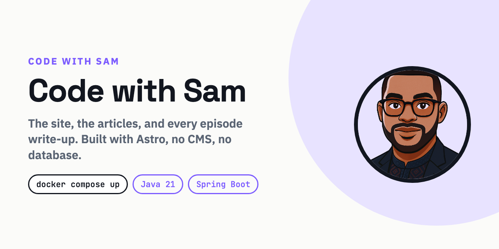

<p>
  <a href="https://github.com/code-with-sam-dev/code-with-sam-dev.github.io/actions/workflows/deploy.yml">
    
  </a>
  
  
  <a href="https://www.youtube.com/@CodewithSam-Dev">
    
  </a>
</p>

# code-with-sam-dev.github.io

The Code with Sam site. Articles, episode write-ups, and links to the code for
each one.

**[Visit the site](https://code-with-sam-dev.github.io)**

## Running it locally

You need Node 20 or newer.

```bash
npm install
npm run dev
```

That serves the site at `http://localhost:4321` with hot reload.

```bash
npm run build      # production build into dist/
npm run preview    # serve dist/ exactly as it will be served live
```

## How it is put together

A static Astro site. No CMS, no database, no server. Articles are Markdown files
and the build turns them into HTML, which is why the whole thing hosts on GitHub
Pages for free and cannot be taken down by a database falling over.

```
src/
  content/blog/     articles, one Markdown file each
  layouts/          the page shell
  components/       reusable pieces, e.g. the article card
  lib/              shared logic: post queries, channel identity
  pages/            routes
  styles/           one global stylesheet, design tokens at the top
public/             files served as is, e.g. posters and favicons
```

### Adding an article

Drop a Markdown file into `src/content/blog/`. The frontmatter schema is defined
and validated in `src/content/config.ts`, so a typo in a field name fails the
build rather than silently rendering nothing.

```yaml
---
title: 'Kafka Ordering Explained'
description: 'One sentence. This is what shows on cards and in search results.'
pubDate: 2026-09-10
series: 'Kafka Payments'      # optional, groups articles into a playlist page
episode: 1                    # optional, orders them within the series
cover: '/covers/name.jpg'     # optional, the video poster shown on cards
duration: '4:18'              # optional, badge on the poster
youtube: 'videoId'            # optional, turns the poster into a player
repo: 'https://github.com/...' # optional, adds the run-it-yourself card
tags: ['kafka', 'interviews']
---
```

Everything else follows automatically: the archive, the series page, the RSS
feed, and the "watch next" links at the bottom of each article.

## Deploying

Pushing to `main` builds and deploys through GitHub Actions. There is no manual
step. `main` is protected, so deployment only happens through a reviewed change.

## Licence

Code is MIT, see [LICENSE](LICENSE). The written articles, images, brand name
and logo are not covered by that licence and remain all rights reserved.
